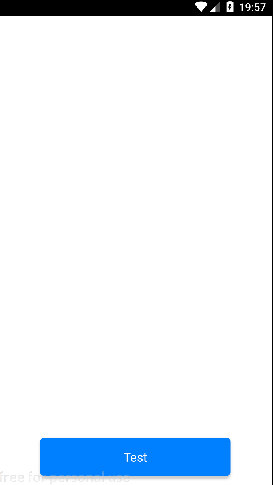

# React Native Starter

React Native Starter.

- React Native Router Flux to Navigation
- TypeScript
- Cocoapods

## Getting Started

Easy-Quick Start

```bash
git clone -b master git@github.com:devdennysegura/react-native-starter.git my-app

cd my-app
yarn
yarn rename "MyNewApp" com.mypackage.mynewapp
yarn start
react-native run-(ios/android)
```

## Usage

* npm install
* open terminal/sell and run `npm run watch`
* open another terminal/sell and run `react-native start`
* open another terminal/sell and run `react-native run android`

